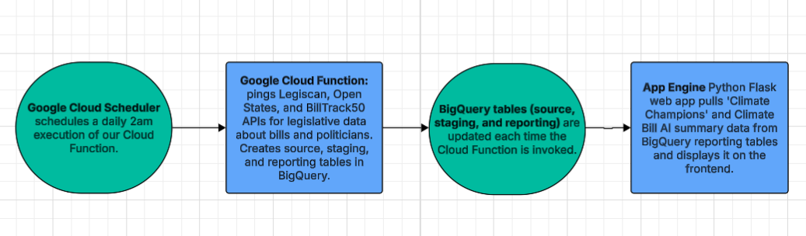
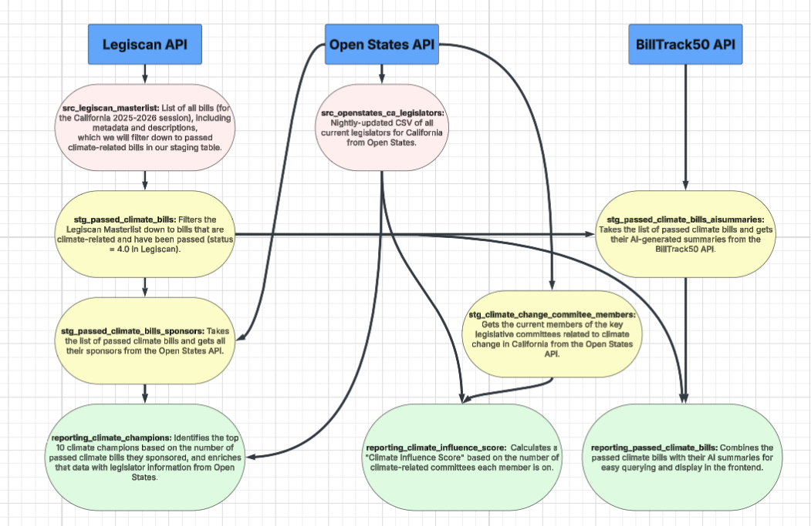

# Climate Champions Project
Data Engineering project to showcase California state legislators who have sponsored passing climate-related bills in the 2025-2026 session. Uses Legiscan, BillTrack50, and Open States APIs and Google Cloud (BigQuery, App Engine, Cloud Functions, Cloud Scheduler). Displays data on a dashboard web app.

## Project Purpose
The purpose of this project is to gain more experience working with key political data APIs ([Legiscan](https://legiscan.com/legiscan), [BillTrack50](https://www.billtrack50.com/documentation/webservices), and [Open States](https://docs.openstates.org/api-v3/)), building data pipelines in Python, database development with BigQuery/SQL/Dataform, cloud architecture (Google Cloud Functions, Google Cloud Scheduler), web development (Flask, HTML/CSS/JavaScript, App Engine), and AI development tools (GitHub Copilot).

Note that this project is currently an MVP / proof-of-concept and more work should be done to improve code style, add additional features, and make some things more generalizable.

## Deployed Web Application
A deployed web application is available at [https://climate-project-489910.uw.r.appspot.com/](https://climate-project-489910.uw.r.appspot.com/).

## Data Architecture Overview

I decided to use Cloud Functions + Cloud Scheduler to host the ETL pipeline because this is a great way to automate daily runs of a relatively lightweight piece of code. Without the overhead of managing a dedicated server, this is also very cost effective.

Depending on how we expand this project in the future, we may decide to try other Google Cloud products like Workflows/Batch (e.g. if we run into Cloud Functions timeout issues).

Right now I am running all of the SQL scripts (to create source, staging, and reporting tables) in one Python file (etl_pipeline.py), but in the future we may want to refactor this code to use DBT or Google Cloud Dataform. These tools would have the advantages of: (i) automated dependency management (DAGs) (ii) integrated data quality testing and (iii) auto-generated data lineage documentation.

## Database Overview

My BigQuery database tables are organized into source, staging, and reporting tables. Source tables reflect raw data gathered from API calls. Staging tables involve some level of data manipulation of those source tables as well as other staging tables. They also sometimes involve additional API calls. Reporting tables query staging tables to fetch only the relevant data fields we want to display on our web app.

Overall I'm happy with my database table structure, though some simplification could be helpful. It's also possible we may not even need to use all three APIs, but I wanted to gain experience with them for the purposes of this project.

If I were to later update this project to use DBT, I would be able to auto-generate data lineage graphs like this instead of making them myself using LucidChart.

## Code Overview
- The data pipeline code is located in etl_pipeline.py. This code calls the LegiScan, BillTrack50, and OpenStates APIs to gather
information about climate-related bills and their sponsors. It creates source, staging, and reporting tables in BigQuery.
- The web app code is located in main.py (App Engine production) and main-local.py (local development). This is a Python Flask
web app. The frontend code is located in static/app.js, static/style.css, and templates/index.html.
- The Google Cloud App Engine setup file is located in app.yaml. We are using App Engine Standard, which has the benefit of scaling
to zero when the web app is not serving much traffic.
- Dependencies are located in requirements.txt.

## Political Data APIs Discussion (Legiscan, BillTrack50, OpenStates)

I enjoyed using these political data APIs to explore data about climate-related bills and their legislative sponsors. Each of them has their pros and cons.

The Legiscan API is great for getting a master list of all bills for a given state's legislative session. One downside to this API is that the documentation is pretty old-fashioned and it is a bit harder to navigate the API response.

The Open States API is great for gathering information about legislators (like emails, birth dates, profile photos, district offices, and district phone numbers). One downside is that apparently bill status updates may lag slightly behind what you would get from Legiscan.

The BillTrack50 API is great for getting AI summaries of bills. I also found it to have the best API documentation and the most intuitive API response to parse. However, one downside is that this API is search-centric, making it hard to retrieve AI summaries for ALL relevant bills in one query. Another downside to this API is that it has strictly-enforced rate limiting (5 requests per second), which is actually kind of annoying.

## Future Work To Be Done
- See if there are better ways to identify climate-related bills (rather than simple keyword search)
- Integrate Vertex AI / Gemini model to analyze whether or not Climate Cabinet would approve each climate-related bill
- Add functionality to find Climate Champion Legislators based on any climate-related bills introduced (without the requirement of passage)
- Generalize code and dashboard from California to All States
- Generalize code and dashboard from 2025-2026 Session to All Available Sessions
- Convert SQL scripts to Dataform SQLX models with appropriate dependencies and scheduling
- Show proof-of-concept app to key stakeholders to gather and implement feedback
- Create Demo Video
